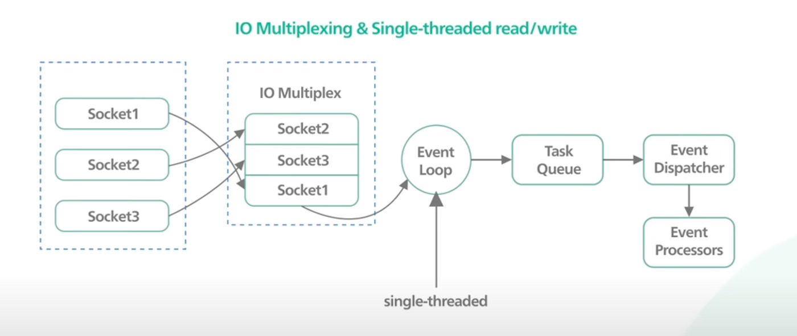
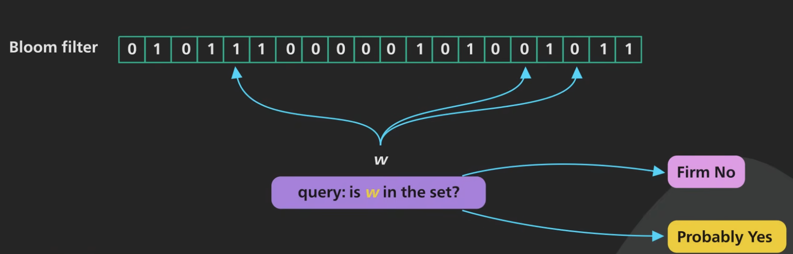
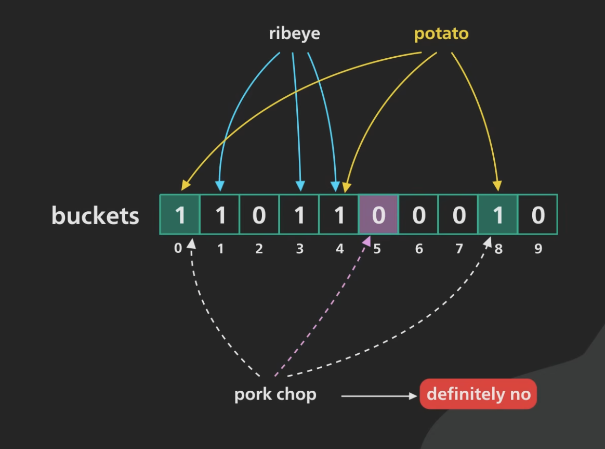
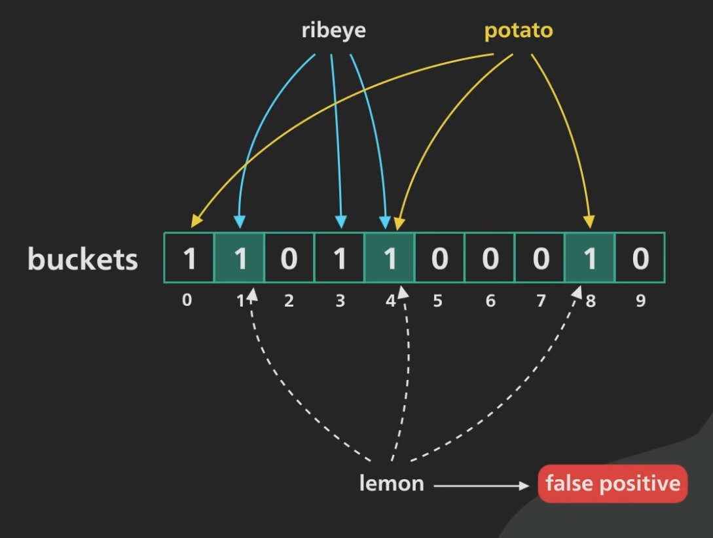
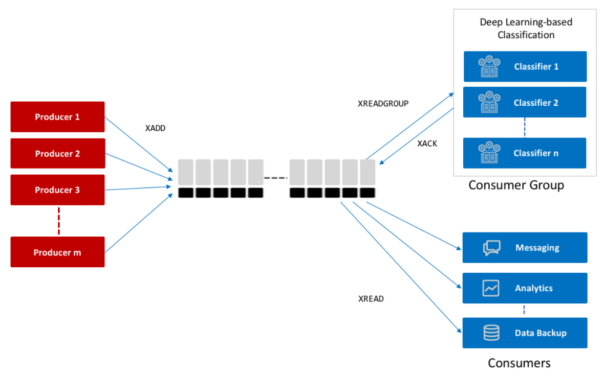
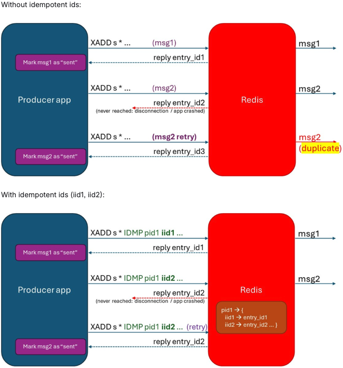

<!-- omit in toc -->
# Chapter 1 - Redis Fundamentals

- [Why Redis in Microservice Architectures](#why-redis-in-microservice-architectures)
- [Execution Model and Core Architecture](#execution-model-and-core-architecture)
  - [Why this matters](#why-this-matters)
- [Latency Hierarchy: Why RAM Changes the Game](#latency-hierarchy-why-ram-changes-the-game)
  - [Architecture Highlights](#architecture-highlights)
- [Data Model and Native Data Structures](#data-model-and-native-data-structures)
  - [Single-node deployment (Docker)](#single-node-deployment-docker)
  - [String](#string)
  - [Hash](#hash)
  - [List](#list)
  - [Set](#set)
    - [Bloom Filter](#bloom-filter)
  - [Sorted Set](#sorted-set)
  - [Stream](#stream)
    - [Idempotation](#idempotation)
  - [HyperLogLog](#hyperloglog)
- [Atomicity, Transactions, and Concurrency Control](#atomicity-transactions-and-concurrency-control)
  - [Single-command atomicity](#single-command-atomicity)
  - [MULTI / EXEC transactions](#multi--exec-transactions)
  - [WATCH for optimistic concurrency](#watch-for-optimistic-concurrency)
- [TTL, Expiration, and Eviction](#ttl-expiration-and-eviction)
  - [TTL and expiration](#ttl-and-expiration)
  - [Eviction policies](#eviction-policies)
- [Persistence Modes and Trade-offs](#persistence-modes-and-trade-offs)
- [Deployment Models (Preview)](#deployment-models-preview)
  - [Single node](#single-node)
  - [Replication](#replication)
  - [Sentinel](#sentinel)
  - [Cluster](#cluster)
- [Key Takeaways](#key-takeaways)
- [Reference](#reference)


## Why Redis in Microservice Architectures

Redis is commonly introduced as a "fast key-value store", but in distributed systems it is better understood as an architectural component that trades memory cost for latency and operational simplicity.

Typical microservice use cases include:

- low-latency caching for read-heavy endpoints,
- counters and lightweight coordination,
- session storage and short-lived state,
- event buffering and stream-like workflows.

The key design question is not only "Can Redis store this data?" but "Which consistency and durability guarantees does this service actually need?"

---

## Execution Model and Core Architecture

Redis is an in-memory data store using an event-driven model. Commands are processed with single-threaded execution semantics for the command path, which provides a very useful property: each command is atomic at the server level.



### Why this matters

- No per-command locking complexity for clients.
- Predictable behavior for read-modify-write patterns that fit in one command.
- Potential bottlenecks when one key becomes hot or when expensive commands block the event loop.

This model is ideal for short, bounded operations and high request rates. It is less ideal for long-running workloads that require complex cross-key transactional guarantees.

---

## Latency Hierarchy: Why RAM Changes the Game

A practical way to motivate Redis is the latency gap between:

- CPU cache,
- DRAM,
- SSD/HDD I/O,
- network round-trips.

Even without exact numbers, the order of magnitude differences explain why moving hot-path reads from disk-backed stores to RAM can significantly reduce API latency and variance.

### Architecture Highlights

- **Single-threaded, event-driven** → uses *select()/poll()* to handle multiple connections without blocking.
  - non usa thread
- **Atomic operations** → each command is executed fully without interruption, simplifying consistency


| Process                             | Duration  | Normalized |
| ----------------------------------- | --------- | ---------- |
| 1 CPU cycle                         | 0.3ns     | 1s         |
| L1 cache access                     | 1ns       | 3s         |
| L2 cache access                     | 3ns       | 9s         |
| L3 cache access                     | 13ns      | 43s        |
| **DRAM access (from CPU)**          | **120ns** | **6min**   |
| SSD I/O                             | 0.1ms     | 4days      |
| HDD I/O                             | 1-10ms    | 1-12months |
| Internet: San Francisco to New York | 40ms      | 4years     |
| Internet: San Francisco to London   | 80ms      | 8years     |
| Internet: San Francisco to Sydney   | 130ms     | 13years    |
| TCP retransmit                      | 1s        | 100years   |
| Container reboot                    | 4s        | 400years   |


---

## Data Model and Native Data Structures

Redis stores key-value pairs, where the value can be a rich native type. Choosing the right type is a design decision, not just a syntax preference.

### Single-node deployment (Docker)

To interact directly with the Redis server, we can use Docker:

```bash
> docker run --detach --name redis -p 6379:6379 redis:latest

# check if it's running
> docker ps
```

```yaml
services:
  redis:
    image: redis:latest
    ports:
      - "6379:6379"
    healthcheck:
      test: [ "CMD", "redis-cli", "ping" ]
      interval: 5s
      timeout: 2s
      retries: 60
```

With Compose, run `docker compose up -d` from the directory that contains this file and wait until the service is healthy.

We can then install a Redis client on the host, connect:

```bash
> redis-cli
```

If you do **not** have `redis-cli` installed locally, open the client inside the container (matches `docker run --name redis` above):

```bash
> docker exec -it redis redis-cli
```

and interact:

```bash
redis:6379> ping
PONG
```

From that prompt, type or paste the command examples in the following sections. To stop and remove the ad-hoc container from `docker run`: `docker stop redis && docker rm redis`.

### String

- Best for simple values, JSON blobs, **integer string counters**, and flags.
- Typical commands: `SET`, `GET`, `DEL`, `INCR`, `INCRBY`, `DECR`, `DECRBY`.

**Strings as counters.** Values are still Redis strings, but commands such as `INCR` parse the stored value as an integer, apply the arithmetic, and write the new value back in a **single server-side operation**. `INCR` adds 1; `INCRBY` adds a given integer; `DECR` and `DECRBY` subtract. If the key does not exist, `INCR` / `INCRBY` behave as if the previous value were **0** (then set the result). This pattern is a standard way to implement **safe counters** without application-level locking for the increment itself.

- ***SET***: Sets the value of the specified key.

```
SET <key> <value>

Example:
SET name "pippo"
```

- ***GET***: Retrieves the value associated with the specified key.

```
GET <key>

Example:
GET name
> "pippo"
```

- ***DEL***: Deletes one or more keys and their associated values.

```
DEL <key> [<key> …]

Example:
DEL name
```

- ***INCR***: Increments the integer stored at the key by 1 (creates / initializes from 0 if the key is missing).

```
INCR <key>

Example:
SET total_crashes 0
INCR total_crashes
> (integer) 1
```

- ***INCRBY***: Increments the integer stored at the key by the given amount.

```
INCRBY <key> <increment>

Example:
INCRBY total_crashes 10
> (integer) 11
```

**Why `INCR` is atomic (and what that prevents).** “Atomic” here means the read–increment–write happens **inside one Redis command**, so concurrent clients do not interleave their own client-side read/modify/write steps. You never get: client A reads `10`, client B reads `10`, both compute `11`, and both store `11`. With two concurrent `INCR` calls on the same key, the value ends at **12**. This is the same **single-threaded command execution** property described earlier: each command runs to completion before the next command is handled, so competing increments serialize correctly without a race on the counter.

For decrementing, `DECR` and `DECRBY` follow the same idea as `INCR` / `INCRBY`.

### Hash

- Best for compact objects with multiple fields (e.g., user profile metadata).
- Typical commands: `HSET`, `HGET`, `HGETALL`.

- ***HSET***: Sets the value of a field in a Hash.

```
HSET <key> <field> <value>

Example:
HSET user:123 name "Charlie"
HSET user:123 country "USA"
```

- ***HGETALL***: Retrieves all fields and values of a Hash.

```
HGETALL <key>

Example:
HGETALL user:123
> 1) "name"
> 2) "Charlie"
> 3) "country"
> 4) "USA"
```

- ***HDEL***: Deletes one or more fields from a Hash.

```
HDEL <key> <field1> [<field2> … <fieldN>]

Example:
HDEL user:123 country
HGETALL user:123
> 1) "name"
> 2) "Charlie"
```

### List

- Redis lists are implemented via Linked Lists

- Best for ordered sequences and simple queue patterns. For example:
  - Remember the latest updates posted by users into a social network.
  - Communication between processes, using a consumer-producer pattern where the producer pushes items into a list, and a consumer (usually a *worker*) consumes those items and executes actions.
- Consider [Redis streams](#stream) as an alternative to lists when you need to store and process an indeterminate series of events.
- Typical commands: `LPUSH`, `RPUSH`, `LPOP`, `RPOP`, `LRANGE`.

- ***LPUSH***: Adds a new element to the head of a list.

```
LPUSH <key> <element> [<element> ...]

Example:
LPUSH bikes:repairs bike:1
```

- ***RPUSH***: Adds a new element to the tail of a list.

```
RPUSH <key> <element> [<element> ...]

Example:
RPUSH bikes:repairs bike:1
```

- ***LPOP***: Removes and returns an element from the head of a list.

```
LPOP <key>

Example:
LPUSH bikes:repairs bike:1 bike:2
LPOP bikes:repairs
> "bike:2"
```

- ***RPOP***: Removes and returns an element from the tail of a list.

```
RPOP <key>

Example:
LPUSH bikes:repairs bike:1 bike:2
RPOP bikes:repairs
> "bike:1"
```

- ***LRANGE***: Gets elements from a list.

```
LRANGE <key> <start> <stop>

Example:
LRANGE bikes:repairs 0 -1
```

### Set

- Best for uniqueness and membership checks. For example:
  - Track unique items 
- Sets membership checks on large datasets (or on streaming data) can use a lot of memory. If you're concerned about memory usage and don't need perfect precision, consider a [Bloom filter](#bloom-filter) as an alternative to a set.
- Typical commands: `SADD`, `SMEMBERS`, `SISMEMBER`, `SCARD`.

- ***SADD***: Creates a set, and adds element to it.

```
SADD <set_name> <element> [<element> ...]

Example:
SADD SocialMedia Facebook Twitter WhatsApp
```

- ***SMEMBERS***: Shows all the elements, present in that set.

```
SMEMBERS <set_name>

Example:
SMEMBERS SocialMedia
> 1) "Facebook" 
> 2) "Twitter"
> 3) "WhatsApp"
```

- ***SISMEMBER***: Returns whether a given member belongs to the set (`1` if present, `0` if not).

```
SISMEMBER <set_name> <member>

Example:
SISMEMBER SocialMedia Twitter
> (integer) 1
SISMEMBER SocialMedia Instagram
> (integer) 0
```

- ***SCARD***: Shows number of elements present in that set.

```
SCARD <set_name>

Example:
SCARD SocialMedia
> 3
```

#### Bloom Filter

* A Bloom filter is a probabilistic data structure in Redis that enables you to check if an element is present in a set using a very small memory space of a fixed size.
* Instead of storing all the items in a set, a Bloom Filter stores only the items' hashed representations, thus sacrificing some precision. The trade-off is that Bloom Filters are very space-efficient and fast.
  * It’s possible to use hash tables to perform this, but Bloom filters are especially useful because they occupy very little space per element.
* A Bloom filter can guarantee the absence of an item from a set, but it can only give an estimation about its presence.




**Use cases**

* Check if a username is taken
* Financial fraud detection

**How does it work?**

* An empty Bloom filter is a bit array of `m bits`, all set to 0. It is equipped with `k` different hash functions, which map set elements to one of the m possible array positions
  * hash functions must produce outputs that are evenly and randomly distributed

*an example with 3 hash functions and a bit array of 10 bits*




* We can control how often we see false positives by choosing the correct size for the bloom filter

**Performance**

* Insertion in a Bloom filter is `O(K)`, where `k` is the number of hash functions.
* Checking for an item is `O(K)` or `O(K*n)` for stacked filters, where `n` is the number of stacked filters.

**Try it out!**


* **`BF.RESERVE`** creates the Bloom filter **before** any insert, with an explicit **false-positive rate** and **expected capacity** (how many distinct items you plan to add before sizing/scaling becomes critical). That makes memory and precision predictable in production instead of relying on defaults created on the first `BF.ADD`. If you omit `BF.RESERVE`, the first `BF.ADD` on a new key creates a filter using **implementation defaults**.

Example session:

```text
BF.RESERVE <key> <error_rate> <capacity>

BF.RESERVE usernames 0.01 100000
OK
BF.ADD usernames alice
(integer) 1
BF.ADD usernames alice
(integer) 0
BF.EXISTS usernames alice
(integer) 1
BF.EXISTS usernames bob
(integer) 0
BF.MADD usernames bob carol
1) (integer) 1
2) (integer) 1
```

* `BF.EXISTS` can still report **false positives** (rare if the filter is sized well); there are **no false negatives** for items you have successfully added.
  * you can try to increase *error_rate* for see how many false positives you have

### Sorted Set

- When fast access to the middle of a large collection of elements is important, we use Sorted Sets
- Best for ranking, scoreboards, and priority-like retrieval. For example:
  - Leaderboards. You can use sorted sets to easily maintain ordered lists of the highest scores in a massive online game.
  - Rate limiters. In particular, you can use a sorted set to build a sliding-window rate limiter to prevent excessive API requests.
- Typical commands: `ZADD`, `ZRANGE`, `ZREVRANGE`.

* Every element in a sorted set is associated with a floating point value, called the *score*. They are ordered according to the following rule:
  * If B and A are two elements with a different score, then A > B if A.score is > B.score.
  * If B and A have exactly the same score, then A > B if the A string is lexicographically greater than the B string. B and A strings can't be equal since sorted sets only have unique elements.

```bash
ZADD <key> <score> <member> [<score> <member>]

> ZADD racer_scores 10 "Norem"
(integer) 1
> ZADD racer_scores 12 "Castilla"
(integer) 1
> ZADD racer_scores 8 "Sam-Bodden" 10 "Royce" 6 "Ford" 14 "Prickett"
(integer) 4

# ascending order
# 0: first element
# -1: last element
# use ZREVRANGE for descending order
# (ZRANGE <key> <start> <stop>)
> ZRANGE racer_scores 0 -1
1) "Ford"
2) "Sam-Bodden"
3) "Norem"
4) "Royce"
5) "Castilla"
6) "Prickett"
```

### Stream

- Best for append-only event flows with consumer groups and acknowledgments.
- A Redis stream is a data structure that acts like an append-only log but also implements several operations to overcome some of the limits of a typical append-only log. These include random access in `O(1)` time and complex consumption strategies, such as consumer groups. You can use streams to record and simultaneously syndicate events in real time. Examples of Redis stream use cases include:
  - Event sourcing (e.g., tracking user actions, clicks, etc.)
  - Sensor monitoring (e.g., readings from devices in the field)
  - Notifications (e.g., storing a record of each user's notifications in a separate stream)
- Typical commands: `XADD`, `XRANGE`, `XREAD`, `XREADGROUP`, `XACK`.


```bash
# with "*" we want the server to generate the entry ID
> XADD race:france * rider Castilla speed 30.2 position 1 location_id 1
"1778238161339-0"
> XADD race:france * rider Norem speed 28.8 position 3 location_id 1
"1778238177018-0"
> XADD race:france * rider Prickett speed 29.7 position 2 location_id 1
"1778238185041-0"
> XRANGE race:france 1778238185041-0 + COUNT 2
1) 1) "1778238185041-0"
   2) 1) "rider"
      2) "Prickett"
      3) "speed"
      4) "29.7"
      5) "position"
      6) "2"
      7) "location_id"
      8) "1"


> XLEN race:france
(integer) 3
```

* **`XREAD`** reads by *last seen* stream ID (per stream). It does **not** create consumer-group delivery state: repeating the same IDs returns the same slice of the log. Use **`0-0`** as a “start from the beginning” sentinel (return entries with IDs strictly after `0-0`). 
  * **`$`** means “only entries **newer than the stream tail at the time this command runs**”.

* **`XREADGROUP`** is for **consumer groups**: each group has its own cursor and **PEL** (pending list). You must **`XGROUP CREATE`** first. 
  * **`>`** means “entries **not yet delivered to this group**” (not a global lock: another group on the same key can still read the same entries with its own `>`). 
  * **`XREADGROUP` never ACKs**—delivered entries stay **pending** for that consumer until **`XACK`** (at-least-once processing). After **`XACK`**, the group is done with those IDs, but rows remain in the stream until you **`XTRIM`** / **`XDEL`** / drop the key ( **`XRANGE`** still shows them).

* **`XGROUP CREATE`** (once per stream + group name):
  * **`0-0`** exposes existing backlog to **`>`**; 
  * **`$`** would start the group at the **current end** so **`>`** only sees **future** `XADD`s (no backlog for that group).

```bash
# XREAD: from the beginning (use 0-0), at most COUNT entries per stream
> XREAD COUNT 10 STREAMS race:france 0-0
1) 1) "race:france"
   2) 1) 1) "1778238161339-0"
         2) 1) "rider"
            2) "Castilla"
            3) "speed"
            4) "30.2"
            ...
      2) 1) "1778238177018-0"
         ...
      3) 1) "1778238185041-0"
         ...

# Blocking tail: only messages appended after this instant (max wait 5s)
> XREAD BLOCK 5000 STREAMS race:france $

# Consumer group: one-time create; 0-0 = existing entries eligible for ">"
> XGROUP CREATE race:france riders 0-0
OK

# Assign up to COUNT entries to this consumer; they are pending until XACK
> XREADGROUP GROUP riders consumer-name COUNT 2 STREAMS race:france >
1) 1) "race:france"
   2) 1) 1) "1778238161339-0"
         2) 1) "rider"
            2) "Castilla"
            ...
      2) 1) "1778238177018-0"
         ...

> XACK race:france riders 1778238161339-0 1778238177018-0
(integer) 2
# Another XREADGROUP ... > would return the next undelivered-for-group entry (e.g. 1778238185041-0), then (nil) until new XADDs
```



#### Idempotation

> Idempotent message processing ensures that handling the same message multiple times produces the same system state as handling it once.

* Redis streams support idempotent message processing (at-most-once production) to prevent duplicate entries when using at-least-once delivery patterns. This feature enables reliable message submission with automatic deduplication.

**Idempotency modes**

```bash
XADD mystream IDMP producer-1 iid-1 * field value      # producer-1 (pid) and iid-1 (iid) are provided manually
XADD mystream IDMPAUTO producer-2 * field value        # producer-2 (pid) is provided manually, Redis provides the iid
```



### HyperLogLog

- HyperLogLog (HLL) estimates the **cardinality** of a set: “**about how many distinct elements** have I seen?” It **trades exact counts for bounded memory**: counting uniques with a normal `SET` grows roughly with the number of distinct values you must remember; an HLL keeps a **small fixed sketch** instead of the elements themselves.

**Redis in practice (from the official description)**  

- The Redis implementation uses **up to about 12 KB per key** and targets a **standard error near 0.81%**

**Core commands**

| Command | Role |
|--------|------|
| `PFADD key element [element …]` | Observe one or more values; updates the sketch. |
| `PFCOUNT key [key …]` | Estimated cardinality of **one** HLL, or of the **union** of several keys if you pass multiple keys (coarser “zoomed out” view, e.g. a neighborhood made of many intersections). |
| `PFMERGE destkey sourcekey [sourcekey …]` | Materialize a new HLL whose estimate matches the **union** of the sources (same idea as counting several sketches at once, but persisted under `destkey`). |

**Worked example (Redis CLI style)**

```bash
> PFADD bikes Hyperion Deimos Phoebe Quaoar
(integer) 1
> PFCOUNT bikes
(integer) 4
> PFADD commuter_bikes Salacia Mimas Quaoar
(integer) 1
> PFMERGE all_bikes bikes commuter_bikes
OK
> PFCOUNT all_bikes
(integer) 6
```

**Intuition from a “traffic heat map” mental model**  

Imagine one HLL **per intersection**, and each passing vehicle contributes an identifier (e.g. a license plate hash) via `PFADD`. A **hotter** intersection shows a **higher** `PFCOUNT`. Calling `PFCOUNT` on **many intersection keys at once** approximates distinct vehicles over the **union** of those roads—useful when you zoom from one corner to a whole district.

**Privacy and duplicates (why this is not a spy database)**  

The sketch does **not** store the raw elements: you cannot “list” or export what was added, only ask for an **estimate**.

**When *not* to use HLL**  

If you need **membership tests**, iteration, or **exact** counts, use a **`SET`** (or another exact structure). HLL is for **large** streams of observations where approximate cardinality and **fixed memory** matter more than perfection.

---

## Atomicity, Transactions, and Concurrency Control

### Single-command atomicity

Every Redis command executes atomically. This is often enough for counters and many update patterns.

### MULTI / EXEC transactions

`MULTI` and `EXEC` let clients queue commands and execute them atomically as a block.

```bash
MULTI
SET order:1:status "CREATED"
HSET order:1 total "39.90"
EXEC
```

### WATCH for optimistic concurrency

`WATCH` can protect read-modify-write flows from concurrent updates. If watched keys change before `EXEC`, the transaction is aborted.

Important clarification for students: Redis transactions are not equivalent to full ACID relational transactions with rollback semantics across arbitrary failure modes.

## TTL, Expiration, and Eviction

### TTL and expiration

TTL defines the validity window of a key. This is critical for:

- cache freshness policies,
- temporary tokens/sessions,
- bounded lifecycle data.

Typical commands: `EXPIRE`, `TTL`, `SETEX`.

### Eviction policies

When memory is constrained, Redis applies the configured eviction policy. Common policies include:

- `noeviction`,
- `allkeys-lru`,
- `volatile-lru`,
- `allkeys-random`.

Architectural implication: eviction strategy must match business semantics. For example, evicting session keys and evicting cache keys have very different consequences.

## Persistence Modes and Trade-offs

Redis supports different durability profiles:

- **No persistence**: best performance, data lost on restart.
- **RDB snapshots**: periodic point-in-time dumps, fast restart, possible data loss between snapshots.
- **AOF**: append write operations for stronger durability, higher I/O overhead.
- **Hybrid (RDB + AOF)**: combines faster recovery with improved durability in many production setups.

Selection depends on Recovery Point Objective (RPO), Recovery Time Objective (RTO), and workload characteristics.

## Deployment Models (Preview)

### Single node

- simplest setup,
- limited by one node's memory/CPU,
- single point of failure.

### Replication

- improves read scalability,
- does not horizontally scale write throughput by itself.

### Sentinel

- adds monitoring and automatic failover.

### Cluster

- shards data across nodes for horizontal scalability and higher aggregate throughput.

Detailed failover, partitioning, and observability topics are expanded in Chapter 5.

## Key Takeaways

- Redis performance is primarily a latency-architecture story, not only a feature story.
- Data structure choice should encode business semantics (order, uniqueness, ranking, replay).
- Atomic commands are powerful, but transactional expectations must stay realistic.
- TTL, eviction, and persistence are first-class design decisions.
- Deployment topology changes operational guarantees and failure behavior.

## Reference

- [Redis data types](https://redis.io/docs/latest/develop/data-types/) — overview of native types, with links to deeper guides and command references.
- [Bloom Filter and Cuckoo Filter](https://redis.io/docs/latest/develop/data-types/probabilistic/) - approximate membership data structures for space-efficient lookups.
- [Probabilistic data types (HyperLogLog)](https://redis.io/docs/latest/develop/data-types/probabilistic/) — overview, commands, limits, and use cases aligned with the Redis documentation.  
- [Redis new data structure: the HyperLogLog](https://antirez.com/news/75) — original write-up of the Redis implementation (error rate, 16k registers, merge, linear counting / bias correction, performance).