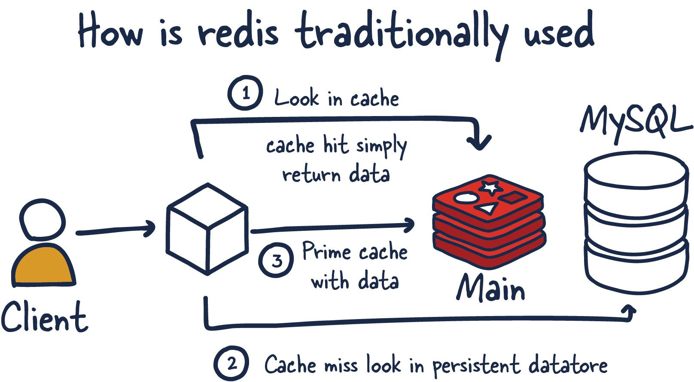
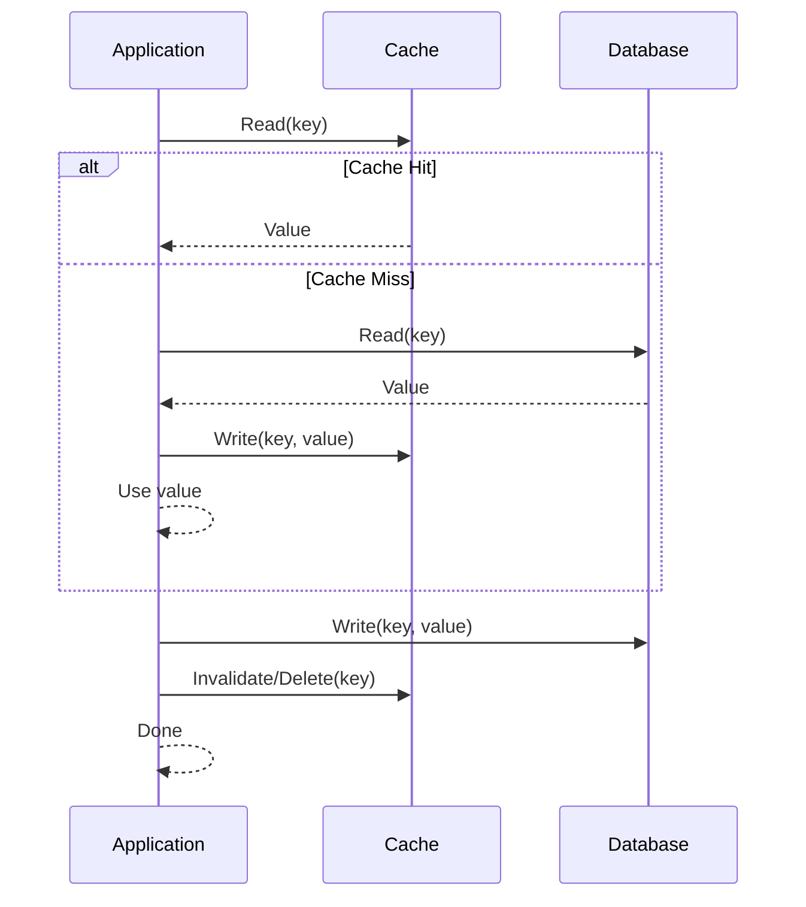
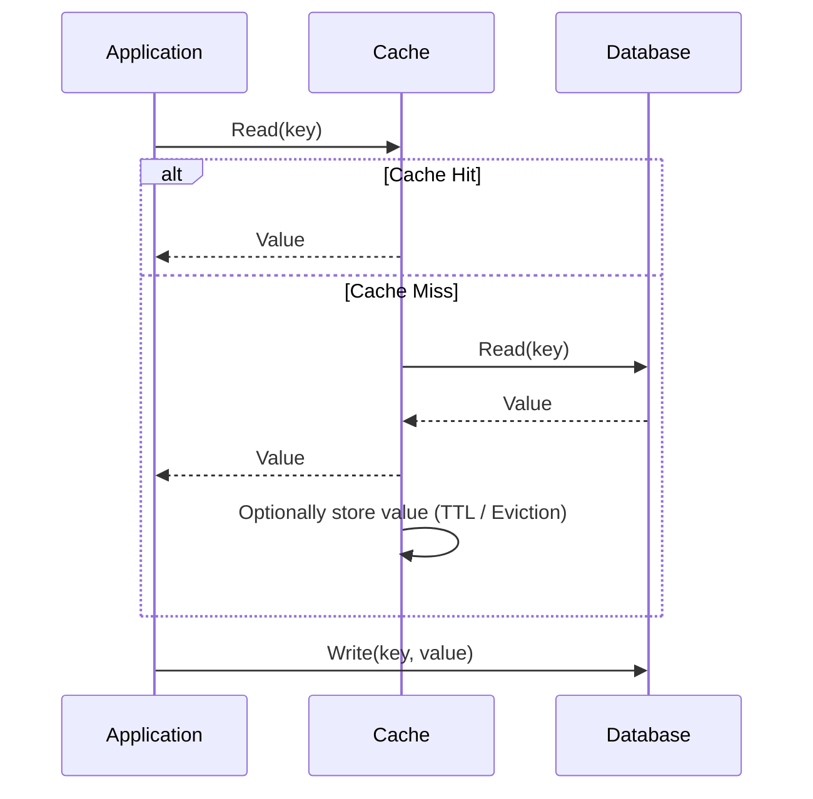
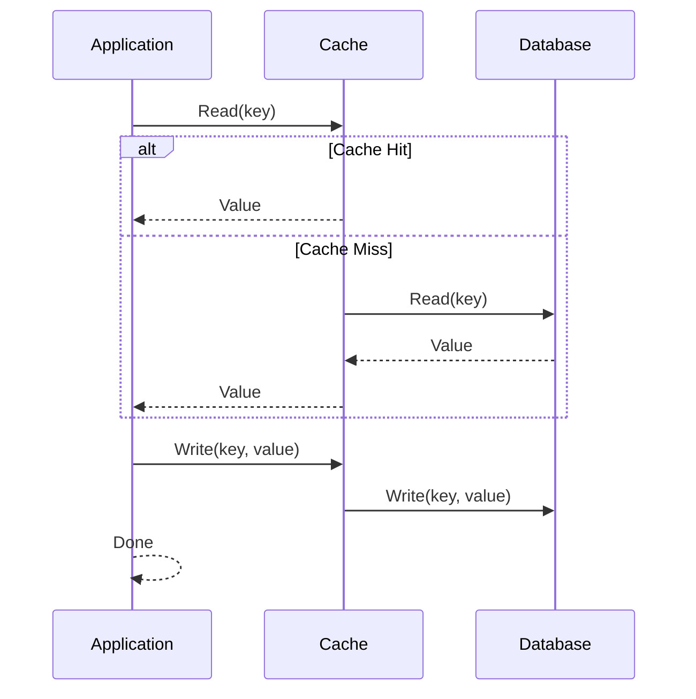
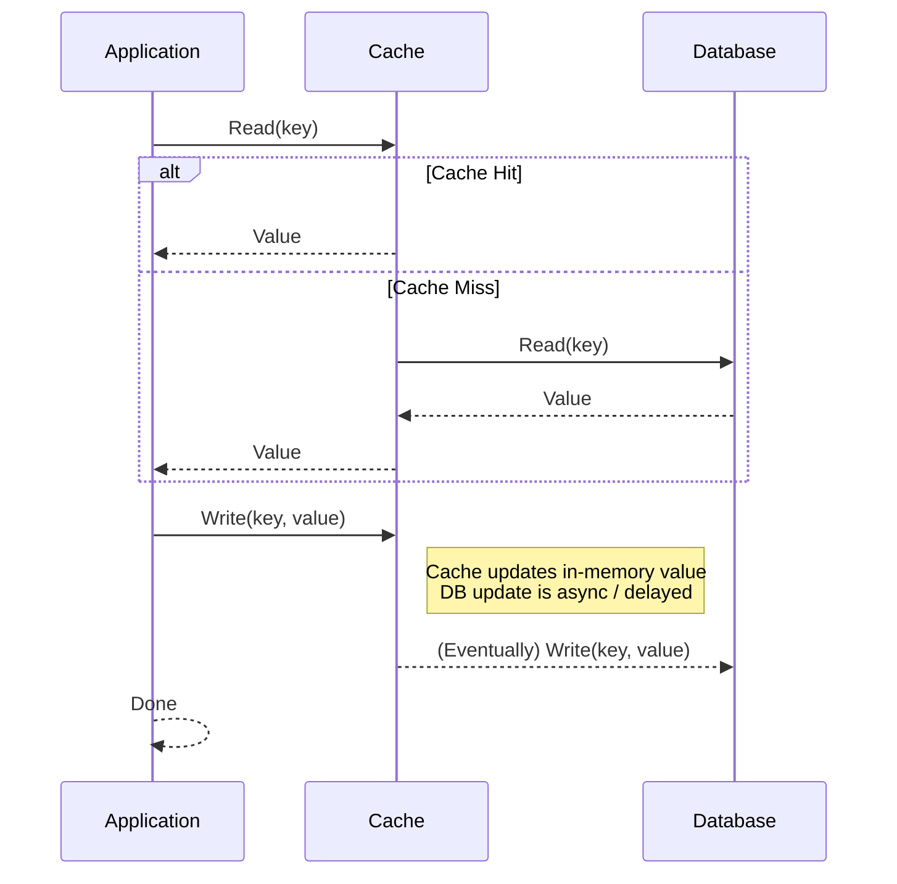

<!-- omit in toc -->
# Chapter 2 - Redis Caching

- [Caching as an Architectural Concern](#caching-as-an-architectural-concern)
- [Cache Placement and Consistency](#cache-placement-and-consistency)
- [Cache Integration Patterns](#cache-integration-patterns)
  - [Cache-aside (lazy loading)](#cache-aside-lazy-loading)
  - [Read-through](#read-through)
  - [Write-through](#write-through)
  - [Write-behind (write-back)](#write-behind-write-back)
- [Spring Boot and Redis for Caching](#spring-boot-and-redis-for-caching)
- [Spring Cache Abstraction](#spring-cache-abstraction)
  - [`@Cacheable`](#cacheable)
  - [`@CacheEvict`](#cacheevict)
  - [`@CachePut`](#cacheput)
- [Reference](#reference)


## Caching as an Architectural Concern

In microservice architectures, Redis is often introduced first as a **cache**: a replica of data that is cheaper to read than the system of record (SQL, document store, remote API). The design question is rarely “how fast is Redis?” alone. It is whether the service can tolerate **eventual consistency** between the cache and the source, and what happens when Redis is **unavailable**, **evicts** keys, or serves **stale** values after writes.

Good caching design ties in these themes: **TTL**, **eviction**, and **no persistence** for pure cache nodes are normal. The API contract you expose to clients should reflect whether reads may lag writes and for how long.



---

## Cache Placement and Consistency

A useful mental model:

- **System of record** — authoritative state (typically the primary database).
- **Cache** — a performance optimization; loss or staleness must be bounded by product rules.

**Stale cache risks** appear whenever a write updates the database but not the cache, or updates the cache in the wrong order relative to the commit. Any pattern can be implemented correctly or incorrectly; the failure mode is usually **read-your-writes** violations or long-lived wrong answers for other clients.

---

## Cache Integration Patterns

These patterns describe **who** loads and invalidates cache entries relative to application code and the datastore. They are not mutually exclusive in a large system; different endpoints may use different patterns.

### Cache-aside (lazy loading)

The application checks the cache first. On a **miss**, it loads from the datastore, populates the cache, and returns the value. Updates typically **write to the datastore first**, then **delete or refresh** the cache entry (invalidation is often simpler than immediate update).

| Aspect | Notes |
|--------|--------|
| Pros | Simple, flexible, widely used; cache failures can degrade to DB reads. |
| Cons | First miss after expiry is slow; risk of **stampede**; invalidation logic must be correct on all write paths. |
| Microservices fit | Default choice for REST read models when you control all writers. |



### Read-through

Cache **library or middleware** loads from the datastore on miss (application asks the cache API only). Semantically similar to cache-aside but **centralizes** load logic in the cache layer.

| Aspect | Notes |
|--------|--------|
| Pros | Consistent load path; can simplify application code if the framework supports it well. |
| Cons | Tighter coupling to cache provider capabilities; harder to express complex multi-table reads. |



### Write-through

Each write goes **through** the cache: the cache is updated together with (or immediately after) the datastore write policy you choose. Readers see updated cache entries without waiting for a miss.

| Aspect | Notes |
|--------|--------|
| Pros | Cache stays warm. |
| Cons | Write latency includes cache latency; still need a story for **partial failures** (DB ok, cache fail, or reverse). |



### Write-behind (write-back)

Writes are acknowledged after updating the cache; persistence to the datastore happens **asynchronously**.

| Aspect | Notes |
|--------|--------|
| Pros | Very low write latency; good for high-throughput systems. |
| Cons | Potential data loss, complex async handling. |




---

## Spring Boot and Redis for Caching

Add Redis integration with the starter (version managed by your Spring Boot BOM):

```xml
<dependency>
  <groupId>org.springframework.boot</groupId>
  <artifactId>spring-boot-starter-data-redis</artifactId>
</dependency>
```

Typical properties:

```properties
spring.data.redis.host=localhost
spring.data.redis.port=6379
```

---

## Spring Cache Abstraction

Spring’s cache abstraction (`org.springframework.cache`) lets you declare caching on methods while swapping **Redis**, **Caffeine**, or other backends via configuration. Redis is a **distributed** cache: entries are visible across instances, unlike a pure in-process cache.

Enable caching:

```java
@SpringBootApplication
@EnableCaching
public class Application { /* ... */ }
```

### `@Cacheable`

Caches the **return value** of a method keyed by parameters (unless you customize the key). On a hit, the method body is **not** executed.

```java
@Cacheable(cacheNames = "books", key = "#isbn")
public Book findByIsbn(String isbn) {
  return bookRepository.findByIsbn(isbn);
}
```

**Design note:** The method should be a **pure read** from the caller’s perspective. If it triggers side effects, those will not run on cache hits.

### `@CacheEvict`

Removes one or more entries—used after **updates** and **deletes** to prevent stale reads.

```java
@CacheEvict(cacheNames = "books", key = "#book.isbn")
public Book updateBook(Book book) {
  return bookRepository.save(book);
}
```

Use `allEntries = true` sparingly: it is a blunt instrument and can cause **thundering herd** on the next wave of reads.

### `@CachePut`

Always runs the method and **puts** the result into the cache. Useful when the method returns the **new** canonical representation after a write.

---

## Reference

- [Spring Boot: Caching](https://docs.spring.io/spring-boot/reference/io/caching.html) — enabling caches, auto-configuration, and property overview.
- [Spring Framework: Cache Abstraction](https://docs.spring.io/spring-framework/reference/integration/cache.html) — `@Cacheable`, `@CacheEvict`, `@CachePut`, and SpEL keys.