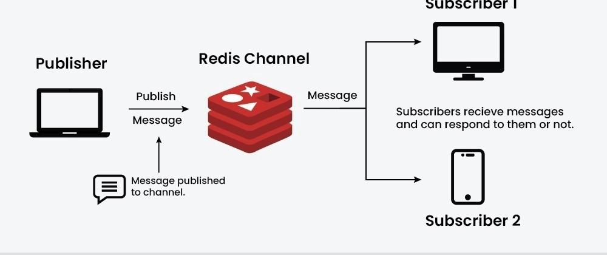
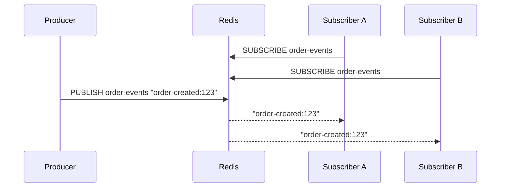
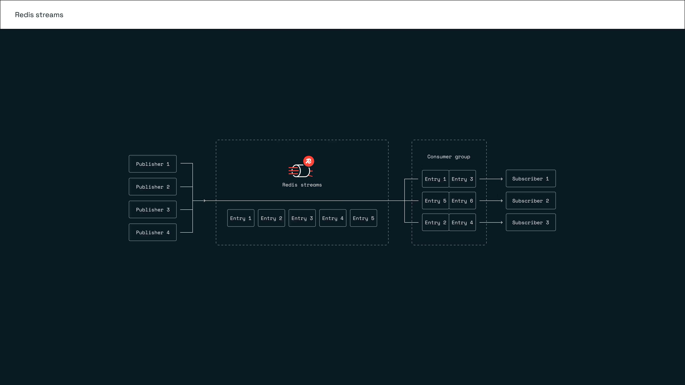
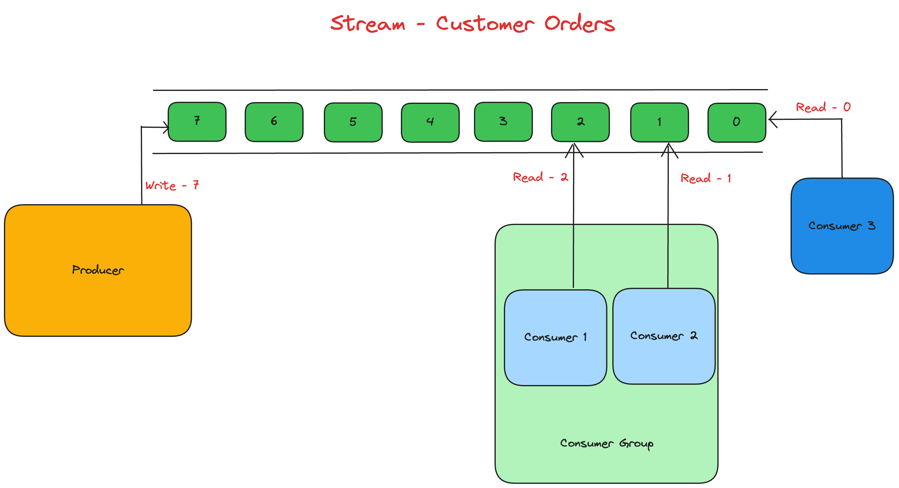
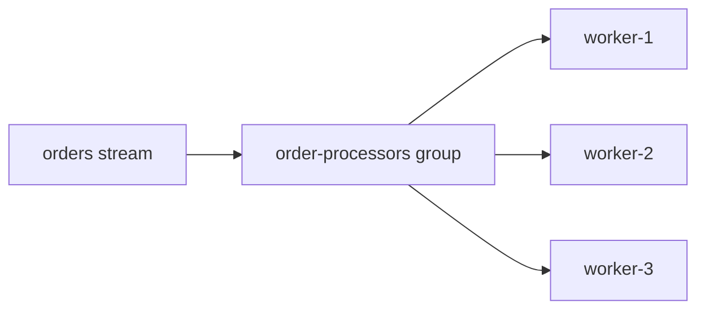
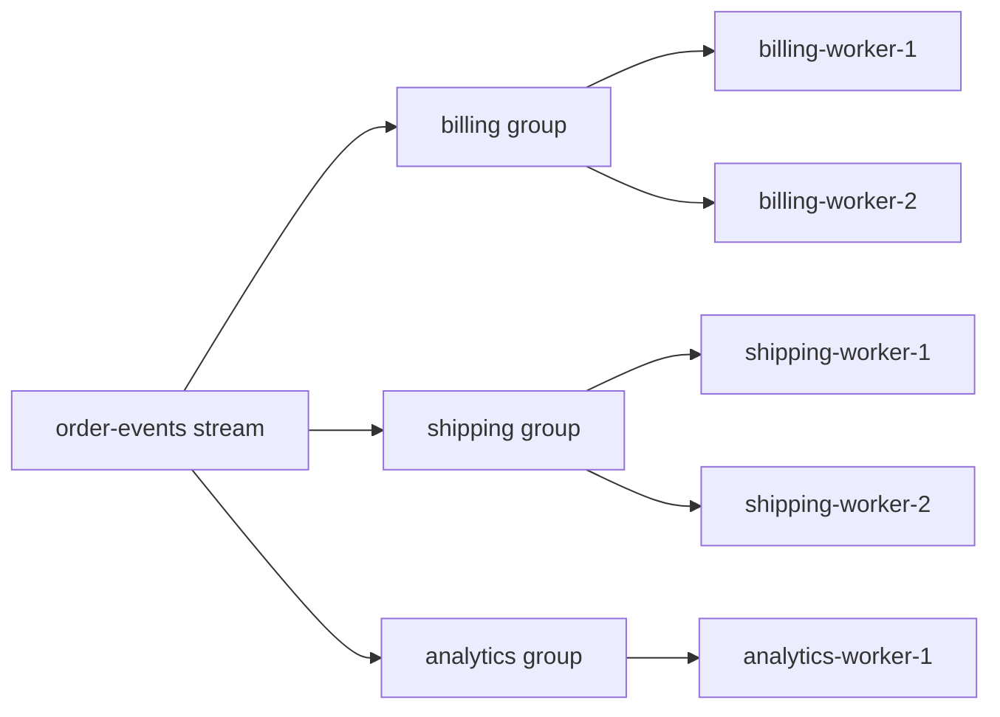

# Chapter 3 - Redis Messaging Streams

- [Chapter 3 - Redis Messaging Streams](#chapter-3---redis-messaging-streams)
  - [Messaging in Microservice Architectures](#messaging-in-microservice-architectures)
  - [Redis Pub/Sub](#redis-pubsub)
    - [Mental model](#mental-model)
    - [Core commands](#core-commands)
    - [Limitations](#limitations)
  - [Redis Streams](#redis-streams)
    - [Append-only event log](#append-only-event-log)
    - [Stream IDs](#stream-ids)
    - [Reading from a stream](#reading-from-a-stream)
    - [Retention and trimming](#retention-and-trimming)
  - [Consumer Groups](#consumer-groups)
    - [Group cursor, consumers, and pending entries](#group-cursor-consumers-and-pending-entries)
    - [Acknowledgment flow](#acknowledgment-flow)
    - [Recovering stuck messages](#recovering-stuck-messages)
  - [Delivery Semantics](#delivery-semantics)
  - [Redis Streams vs Dedicated Brokers](#redis-streams-vs-dedicated-brokers)
  - [Design Guidelines](#design-guidelines)
  - [Reference](#reference)

## Messaging in Microservice Architectures

Messaging decouples services in time. Instead of one service calling another synchronously and waiting for the full downstream workflow, a producer publishes a message and one or more consumers react to it.

This is useful when we need:

- **fan-out**: many services react to the same event;
- **buffering**: producers and consumers have different speeds;
- **resilience**: temporary consumer failures should not lose important work;
- **event history**: consumers may need to replay previous events.

Redis provides two different messaging models:

- **Pub/Sub**: real-time, ephemeral broadcast.
- **Streams**: persisted append-only log with consumer groups and acknowledgments.

---

## Redis Pub/Sub

Redis Pub/Sub is the simplest messaging primitive in Redis. A client subscribes to a channel, another client publishes a message, and Redis forwards that message to all clients currently subscribed to the channel.

Conceptually, Pub/Sub is close to the **Observer** pattern: publishers do not know which subscribers exist, and subscribers react to messages emitted on a topic-like channel.



### Mental model




Pub/Sub is a **live broadcast**. Redis does not store messages for later delivery. If a subscriber is disconnected when a message is published, that subscriber misses the message.

### Core commands

```bash
# Terminal 1
> SUBSCRIBE notifications
1) "subscribe"
2) "notifications"
3) (integer) 1

# Terminal 2
> PUBLISH notifications "user:42 logged in"
(integer) 1
```

`PUBLISH` returns the number of clients that received the message at that instant. A return value of `0` means no client was listening; the message is not queued.

Pattern subscriptions allow matching multiple channels:

```bash
> PSUBSCRIBE order.*

> PUBLISH order.created "order:123"
> PUBLISH order.cancelled "order:124"
```

### Limitations

Pub/Sub is intentionally lightweight, but the trade-offs are important:

- **No persistence**: messages are not written to a log.
- **No replay**: late subscribers cannot read old messages.
- **No acknowledgment**: Redis does not know whether a subscriber processed the message successfully.
- **No consumer groups**: every connected subscriber receives the broadcast; Redis does not distribute work across workers.
- **At-most-once delivery in practice**: if the subscriber is offline or fails while handling the message, Redis will not redeliver it.

Avoid Pub/Sub for business-critical workflows where losing a message means losing an order, payment, email, or audit event.

---

## Redis Streams

Redis Streams are a persistent append-only data structure for event flows. A stream stores entries in insertion order; each entry has an ID and a set of field-value pairs.

Streams are useful when Pub/Sub is too ephemeral but a full external broker would be operationally heavier than needed.

Typical use cases:

- event-driven workflows inside a bounded system;
- background job queues with retry and acknowledgment;
- audit-like event trails with bounded retention;
- IoT or telemetry ingestion where consumers may process at different speeds.



### Append-only event log

```bash
> XADD orders * type created orderId 123 amount 49.90
"1715600000000-0"

> XADD orders * type paid orderId 123 paymentId pay_987
"1715600001000-0"

> XLEN orders
(integer) 2
```

`XADD` appends a new entry. The `*` asks Redis to generate the ID. Unlike Pub/Sub, the entry remains in the stream until it is trimmed, deleted, or the key is removed.

Each stream entry is a small map:

```text
ID: 1715600000000-0
Fields:
  type    -> created
  orderId -> 123
  amount  -> 49.90
```

### Stream IDs

A Redis Stream ID has the form:

```text
<millisecondsTime>-<sequenceNumber>
```

Example:

```text
1715600000000-0
```

The timestamp part usually comes from the server clock. The sequence number disambiguates multiple entries created in the same millisecond.

Important ID shortcuts:


| ID    | Meaning                                                                   |
| ----- | ------------------------------------------------------------------------- |
| `*`   | Generate a new ID on `XADD`.                                              |
| `0-0` | Start before the first possible stream entry. Useful for reading backlog. |
| `$`   | Current end of the stream. Useful when you only want future messages.     |
| `>`   | In consumer groups, read entries never delivered to this group.           |


### Reading from a stream

Read a range:

```bash
> XRANGE orders - +
1) 1) "1715600000000-0"
   2) 1) "type"
      2) "created"
      3) "orderId"
      4) "123"
      5) "amount"
      6) "49.90"
2) 1) "1715600001000-0"
   2) 1) "type"
      2) "paid"
      3) "orderId"
      4) "123"
      5) "paymentId"
      6) "pay_987"
```

Read new entries after a known ID:

```bash
> XREAD COUNT 10 STREAMS orders 1715600000000-0
```

Block while waiting for new entries:

```bash
> XREAD BLOCK 5000 STREAMS orders $
```

`XREAD` is cursor-based, but the cursor is managed by the client. Redis does not remember which messages a normal `XREAD` client has processed.

### Retention and trimming

Streams are persistent, but they are not automatically infinite. Production systems need a retention policy.

Trim approximately by length:

```bash
> XADD orders MAXLEN ~ 10000 * type created orderId 124
```

Or trim explicitly:

```bash
> XTRIM orders MAXLEN ~ 10000
```

The `~` means approximate trimming. Redis can trim more efficiently without guaranteeing an exact length. This is usually the right trade-off for high-throughput streams.

Retention is a business decision:

- short retention for job queues where acknowledged work no longer matters;
- longer retention for replay, analytics, debugging, or audit workflows;
- external storage, or a durable event log such as Kafka, if events are a long-term source of truth.

---

## Consumer Groups

Consumer groups let multiple workers cooperate on the same stream. Redis tracks which entries were delivered to the group and which are still pending acknowledgment.

This is the feature that makes Streams behave more like a lightweight broker.



### Group cursor, consumers, and pending entries

Create a group:

```bash
> XGROUP CREATE orders order-processors 0-0
OK
```

`0-0` means the group can consume existing backlog. If we used `$`, the group would start from the current end and only receive future entries.

Read as a named consumer:

```bash
> XREADGROUP GROUP order-processors worker-1 COUNT 2 STREAMS orders >
```

The pieces are:


| Concept  | Meaning                                                              |
| -------- | -------------------------------------------------------------------- |
| Stream   | The ordered log, e.g. `orders`.                                      |
| Group    | A logical subscription with its own cursor, e.g. `order-processors`. |
| Consumer | A worker identity inside the group, e.g. `worker-1`.                 |
| PEL      | Pending Entries List: delivered but not acknowledged entries.        |


The `>` ID means "give this consumer entries never delivered to this group".

With multiple consumers in the same group, Redis distributes entries among them:




Every entry is normally assigned to one consumer in the group. A different group can independently read the same stream with its own cursor.

For example, one `order-events` stream can feed different logical workflows. Each group receives its own logical copy of the stream; workers inside the same group divide the work.



In this model, `billing`, `shipping`, and `analytics` can all observe the same order events independently. Inside `billing`, however, `billing-worker-1` and `billing-worker-2` compete for messages from the `billing` group, so the same entry is normally processed by only one billing worker.

Example setup:

```text
stream: order-events

group: billing
  - billing-worker-1
  - billing-worker-2

group: shipping
  - shipping-worker-1
  - shipping-worker-2

group: analytics
  - analytics-worker-1
```

Create the stream groups:

```bash
> XGROUP CREATE order-events billing 0-0 MKSTREAM
OK
> XGROUP CREATE order-events shipping 0-0
OK
> XGROUP CREATE order-events analytics 0-0
OK
```

Append a few order events:

```bash
> XADD order-events * type order-created orderId 123 amount 49.90
"1715600000000-0"
> XADD order-events * type order-paid orderId 123 paymentId pay_987
"1715600001000-0"
> XADD order-events * type order-ready-to-ship orderId 123 warehouse EU-1
"1715600002000-0"
```

A billing worker reads as part of the `billing` group:

```bash
> XREADGROUP GROUP billing billing-worker-1 COUNT 2 BLOCK 5000 STREAMS order-events >
```

`BLOCK 5000` means: if no new entries are available for the `billing` group, wait up to 5 seconds before returning. This lets workers stay idle without constantly polling Redis.

After successful processing, the worker acknowledges the entries:

```bash
> XACK order-events billing 1715600000000-0 1715600001000-0
(integer) 2
```

The worker usually runs this logic in a loop:

```text
while worker is running:
  entries = XREADGROUP GROUP billing billing-worker-1 COUNT 2 BLOCK 5000 STREAMS order-events >

  if entries are empty:
    continue

  for each entry:
    process business logic

  XACK successfully processed entry IDs
```

Other workers use the same pattern with their own consumer name:

```bash
> XREADGROUP GROUP billing billing-worker-2 COUNT 2 BLOCK 5000 STREAMS order-events >
> XREADGROUP GROUP shipping shipping-worker-1 COUNT 2 BLOCK 5000 STREAMS order-events >
> XREADGROUP GROUP analytics analytics-worker-1 COUNT 2 BLOCK 5000 STREAMS order-events >
```

The `billing` workers divide the `billing` group work between themselves. The `shipping` and `analytics` groups still receive the same stream independently, because each group has its own cursor and pending list.

### Acknowledgment flow

Consumer group processing is an at-least-once workflow. In the `order-events` example above, a billing worker reads entries with `XREADGROUP`, processes them, and then confirms completion with `XACK`.

1. `XREADGROUP` delivers an entry to a consumer.
2. Redis puts the entry in the group's pending list.
3. The consumer processes the work.
4. The consumer calls `XACK`.
5. Redis removes the entry from the pending list.

`XACK` does not delete the stream entry. It only marks that the group no longer has that entry pending. The entry can still appear in `XRANGE` until retention removes it.

### Recovering stuck messages

If a consumer crashes after delivery but before `XACK`, the entry remains pending. Another worker can inspect and claim old pending entries.

Inspect pending state:

```bash
> XPENDING orders order-processors
1) (integer) 1
2) "1715600000000-0"
3) "1715600000000-0"
4) 1) 1) "worker-1"
      2) "1"
```

Automatically claim entries idle for more than 60 seconds:

```bash
> XAUTOCLAIM orders order-processors worker-2 60000 0-0 COUNT 10
```

This is the core recovery mechanism for worker crashes. It also explains why consumers must be **idempotent**: a message may be processed once, crash before `XACK`, then be claimed and processed again by another worker.

---

## Delivery Semantics

Messaging systems are usually described with three delivery semantics:


| Semantics     | Meaning                                                                   | Redis fit                                                             |
| ------------- | ------------------------------------------------------------------------- | --------------------------------------------------------------------- |
| At-most-once  | A message is delivered zero or one time. It can be lost, but not retried. | Pub/Sub is effectively at-most-once.                                  |
| At-least-once | A message is retried until acknowledged. Duplicates are possible.         | Streams with consumer groups and `XACK`.                              |
| Exactly-once  | Each message affects the system once, even with retries and crashes.      | Not guaranteed by Redis alone. Requires idempotent application logic. |


In practice, most reliable message processing systems are **at-least-once + idempotent consumer**.

Idempotent processing means that handling the same message multiple times produces the same final business state. Common techniques:

- store a processed message ID in the database with a unique constraint;
- make updates naturally idempotent, e.g. `SET status = PAID` instead of "add paid status again";

For example, if an email worker crashes after sending the email but before `XACK`, Redis may redeliver the message. Without an idempotency check, the user may receive the email twice.

---

## Redis Streams vs Dedicated Brokers

Redis Streams can solve many internal messaging problems, but it is not a drop-in replacement for every broker.


| Need                                           | Redis Pub/Sub | Redis Streams                      | Kafka / RabbitMQ / dedicated broker |
| ---------------------------------------------- | ------------- | ---------------------------------- | ----------------------------------- |
| Live broadcast                                 | Good          | Possible, but heavier              | Good                                |
| Persistence                                    | No            | Yes, bounded by retention          | Yes                                 |
| Replay                                         | No            | Yes, while entries are retained    | Strong, depending on broker         |
| Consumer groups                                | No            | Yes                                | Yes                                 |
| Acknowledgments                                | No            | Yes                                | Yes                                 |
| Large long-term event log                      | No            | Limited by Redis memory/cost model | Kafka is usually better             |
| Complex routing                                | Limited       | Application-defined                | RabbitMQ is usually better          |
| Operational simplicity if Redis already exists | Excellent     | Good                               | Lower                               |


Good Redis Streams fit:

- the team already operates Redis;
- events are moderate in volume and retention;
- low latency matters;
- the stream is part of application infrastructure, not the company's canonical event backbone.

Prefer a dedicated broker when:

- event retention is measured in days, weeks, or months at high volume;
- many independent teams depend on the event log as a platform;
- losing Redis memory capacity would make messaging too expensive.

---

## Design Guidelines

Choose the messaging primitive based on failure behavior:

- Use **Pub/Sub** for transient notifications where missing a message is acceptable.
- Use **Streams without consumer groups** for simple append-and-read event history where each client manages its own cursor.
- Use **Streams with consumer groups** for worker pools, retries, and at-least-once processing.
- Use a **dedicated broker** when messaging is a central platform capability rather than a local service concern.

Keep these rules in code reviews:

- Every stream should have an explicit retention policy.
- Every consumer group should have a recovery story for pending messages.
- Every at-least-once consumer should be idempotent.
- `XACK` should happen after the business side effect succeeds.
- Stream entry fields should be stable and versionable enough for independent consumers.

---

## Reference

- [Redis Pub/Sub](https://redis.io/docs/latest/develop/pubsub/) — channel-based message broadcasting and delivery characteristics.
- [Redis Streams](https://redis.io/docs/latest/develop/data-types/streams/) — stream data type, entries, consumer groups, and command examples.
- [Redis Streams introduction by antirez](https://antirez.com/news/114) — original design motivation and mental model for Streams.

