# Chapter 4 - Redis Distributed Patterns

- [Chapter 4 - Redis Distributed Patterns](#chapter-4---redis-distributed-patterns)
  - [Why Redis for coordination](#why-redis-for-coordination)
  - [Distributed locks](#distributed-locks)
    - [Minimal pattern: SET NX with expiry](#minimal-pattern-set-nx-with-expiry)
    - [Correctness caveats](#correctness-caveats)
    - [Fencing tokens and the system of record](#fencing-tokens-and-the-system-of-record)
  - [Rate limiting](#rate-limiting)
    - [Fixed window (counter + TTL)](#fixed-window-counter--ttl)
    - [Sliding window log](#sliding-window-log)
    - [Token bucket on Redis](#token-bucket-on-redis)
  - [Session sharing](#session-sharing)
  - [Idempotency keys](#idempotency-keys)
  - [Reference](#reference)

---

## Why Redis for coordination

In a distributed deployment, several replicas of the same service run concurrently. Without a shared notion of **who may act now**, **how often**, or **what was already done**, you get duplicate work, race conditions, and inconsistent user-visible state.

Redis is often used as a **low-latency coordination store**: not the system of record for business entities, but a place to hold **leases**, **counters**, **sessions**, **rankings**, and **deduplication keys** with well-understood primitives (strings, hashes, sorted sets). **Redis makes coordination easy; making it correct under failure and clock skew is the hard part.**

---

## Distributed locks

A **distributed lock** grants exclusive access to a resource (a row, a file, a shard, an external API) across processes and machines.

### Minimal pattern: SET NX with expiry

The usual Redis pattern is a single key whose value identifies the **owner** (e.g. UUID), created only if absent, with a **TTL** that acts as a lease:

```text
SET lock:orders:123 <owner-uuid> NX PX 30000
```

- **NX** — set only if the key does not exist (atomic “test and set”).
- **PX** — expiry in milliseconds so a crashed holder cannot block the lock forever.

Release must be **conditional**: delete the key only if the value still matches the owner. Otherwise you can delete another process’s lock after your lease expired and you were slow.

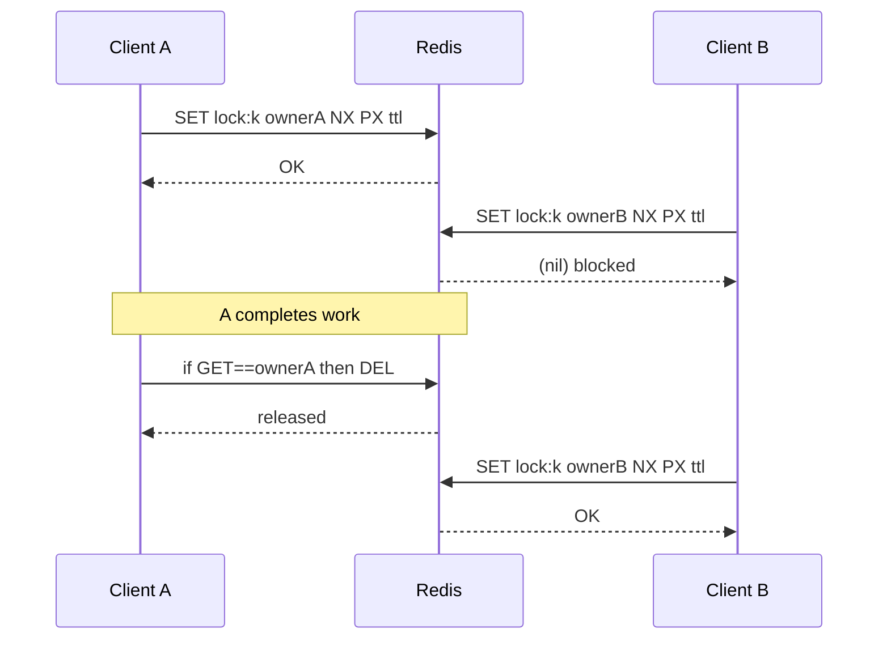


### Correctness caveats


| Risk              | What goes wrong                                                                          | Mitigation idea                                                                               |
| ----------------- | ---------------------------------------------------------------------------------------- | --------------------------------------------------------------------------------------------- |
| **TTL too short** | Work still running; lock expires; another client enters → **double execution**.          | **extend lease** in-process if safe; or **short lock + idempotent** downstream.               |
| **TTL too long**  | Crash before release → others wait until expiry.                                         | Trade availability vs safety; monitor lock wait time.                                         |
| **No fencing**    | Stale holder finishes after lease expiry and **writes anyway** → last writer wins chaos. | **Fencing token** (monotonic) accepted only if greater than last seen by storage (see below). |


### Fencing tokens and the system of record

**Fencing** means the protected resource (database, object store) rejects late writes from an **expired** lock holder.

1. Before taking the lock, read a **current max token** from the system of record (or a dedicated Redis counter with `INCR`).
2. Acquire lock; attach **token** to each mutation.
3. Storage applies writes only if `incoming_token > last_committed_token`.


---

## Rate limiting

**Rate limiting** bounds how many requests per key (user, IP, tenant, API key) are allowed in a time window. Redis fits because operations are **fast** and **atomic** at key granularity.

### Fixed window (counter + TTL)

The **fixed-window counter** splits time into **fixed intervals** (seconds, minutes, hours). For each interval you count requests for a **scope** (user id, IP, tenant, API key). If the count **exceeds** a predefined limit, requests are **blocked** until the **next** interval—like a speed limit: exceed it → red light until the window opens again.

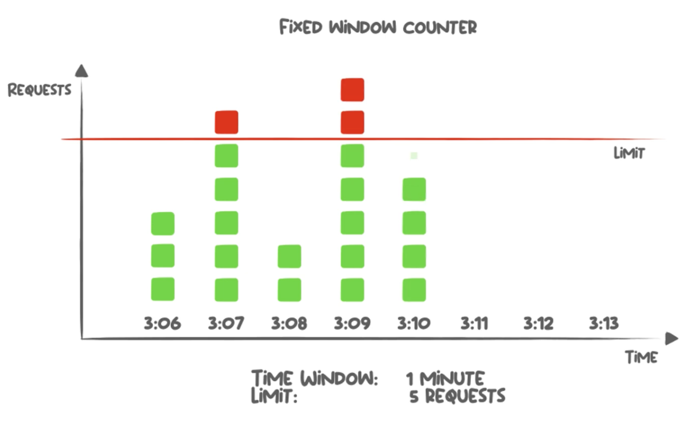

**Four steps**

1. **Define the window** — e.g. 1 second or 60 seconds (`windowMs`).
2. **Track requests** — a single **counter** per `(scope, window)` in Redis.
3. **Reset** — when the window ends, the counter is discarded or recreated (typically **TTL on the key**).
4. **Enforce** — if `count >= limit`, deny; otherwise allow and increment.

**Key design** — one Redis key per scope (e.g. `ratelimit:<clientId>`, optionally plus route or tenant), so counters for different callers do not overwrite each other.

**Decision flow (each incoming request)**

1. **Read** the current count for that scope (if the key does not exist, treat the count as **0**).
2. If the count is already **≥ limit** → **deny** (policy choice: skip increment or still record—most APIs simply reject).
3. Otherwise **allow** this request: **increment** the counter and attach a **TTL** that matches the window length so the key disappears when the window ends (next window starts fresh).

**Why the TTL must not “slide”** — the expiry defines when the window **closes**. If you **reset TTL on every request**, the key keeps living longer and the window **never** aligns with clock time anymore. The usual fix is to set expiry **only on the first write of the window** (in Redis: `PEXPIRE … NX`).

`PEXPIRE key milliseconds` — sets the key’s **remaining lifetime** in milliseconds; when it expires, Redis deletes the key so the counter resets for the next clock window.

`PEXPIRE key ms NX` — applies that TTL **only if the key does not already have one**. If a TTL is already counting down, the command **does not** extend or replace it. That pins the window end on the **first** write of the interval instead of **sliding** the deadline on every request.

**Why atomicity matters** — many app replicas may call Redis at once. Separating “read count” and “write count” in two unrelated round-trips opens a **race** (two instances both see `4`, both increment, you overshoot the limit).

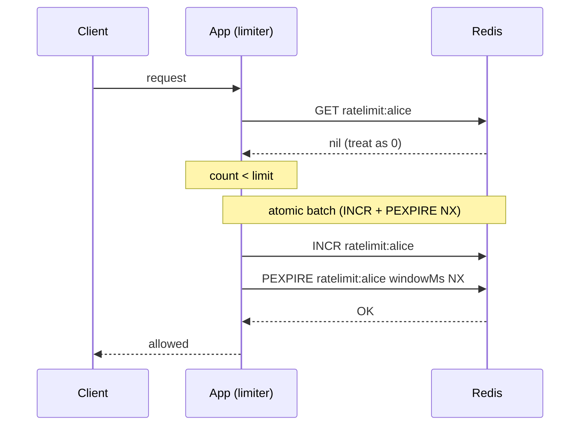


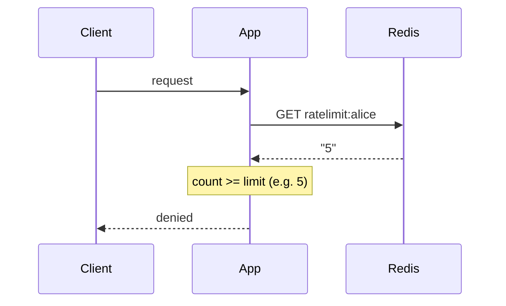


**Edge burst** — the limit is “per **clock** window”, not “per **any** sliding span of length T”. At the **boundary** between two windows, a client can send **almost 2× the nominal rate** in real time (e.g. 100 at the end of second A + 100 at the start of second B).

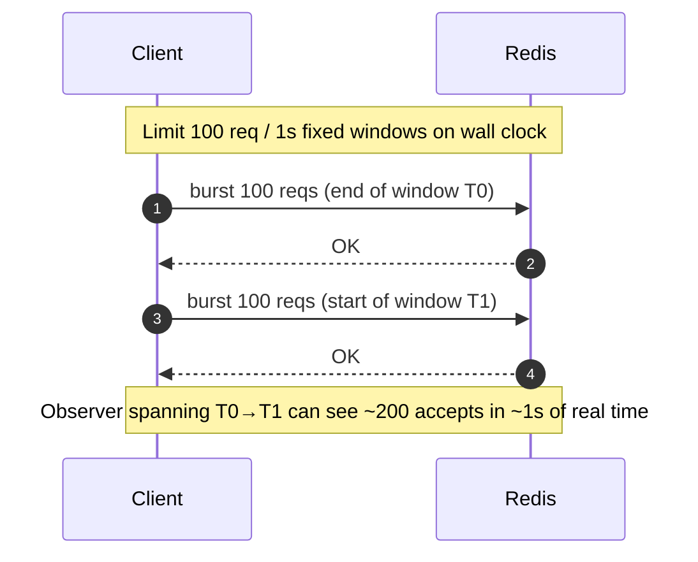


### Sliding window log

Unlike a **fixed window**, the limit applies to a **rolling** interval: “how many requests in the **last** *T* seconds?”, so enforcement reacts **immediately** as old events age out—no waiting for the next calendar bucket.

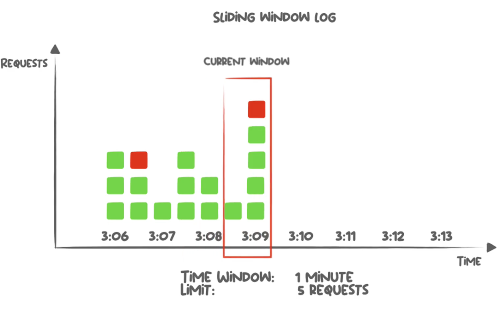

**Four steps**

1. **Choose *T*** — the rolling horizon (e.g. 1 minute).
2. **Log each allowed request** — record something unique per event (timestamp and/or id).
3. **Drop what is outside the window** — remove entries older than `now − T`.
4. **Count and enforce** — if in-window count **≥ limit**, block; otherwise allow and append to the log.

**Two Redis shapes (same idea, different primitives)**

- **Classic — sorted set (`ZSET`)** — score = epoch ms, member = unique id; one entry per allowed request (memory grows with traffic).

Walk-through for the next request (`now_ms` from `TIME` or app clock, `cutoff = now_ms − T_ms`, `limit = 2`):

```text
# now_ms = 1700000003000, T_ms = 60000 → cutoff = 1699940003000

ZADD ratelimit:user:42 1700000001000 req-001
→ 1                                    # new member added

ZADD ratelimit:user:42 1700000002000 req-002
→ 1

ZREMRANGEBYSCORE ratelimit:user:42 -inf 1699940003000
→ 0                                    # removed entries with score ≤ cutoff

ZCARD ratelimit:user:42
→ 2                                    # in-window count

# 2 ≥ limit → reject req-003 (skip ZADD)
```

### Token bucket on Redis

The **token bucket** shapes traffic smoothly: a bucket holds up to `C` tokens; tokens **refill** continuously at rate `r` (same time unit everywhere, e.g. per second). Each **allowed** request spends **one** token. If the bucket is **empty**, block (or queue) until refill catches up. Unlike a hard fixed clock, you can **burst** briefly as long as you still have banked tokens under `C`.

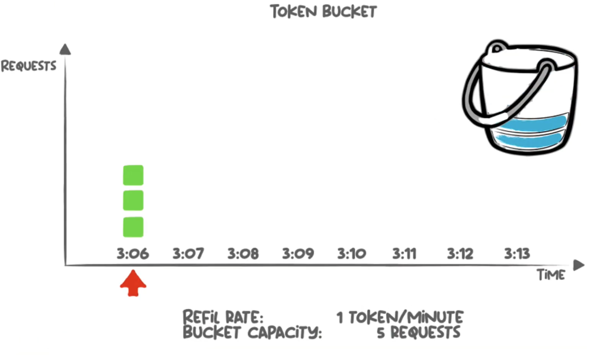

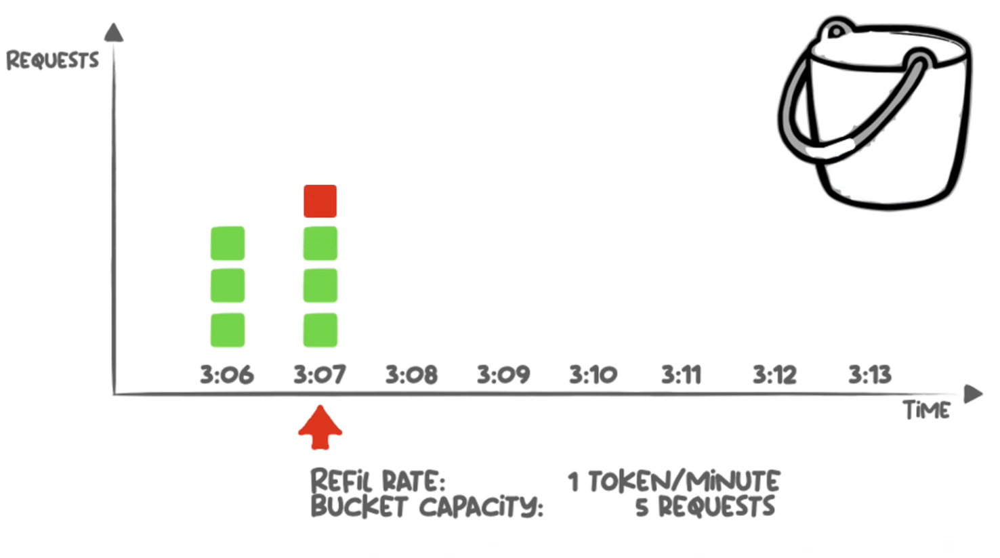

**Four steps**

1. **Pick `C` and `r`** — max tokens in the bucket and refill speed.
2. **Persist state** — current **token count** and **last refill time** (`now` when you last applied refill math).
3. **On each request** — compute `elapsed = now − last_refill`, add `elapsed × r` to the count, **clamp** to `C`, then set `last_refill = now`.
4. **Decide (admit or reject)** — step 3 already refilled and set `last_refill = now`. The balance `tokens` (≤ `C`) is what you charge against; each request costs **one whole token**:
   - `tokens ≥ 1` → **allow**.
   - `tokens < 1` → **deny**.

   Example (`C = 10`, `r = 2`/s) — step 3 then step 4:

   ```text
   # Deny: bucket was empty, little time passed
   tokens_before = 0,  elapsed = 0.2 s
   → refill: min(10, 0 + 0.2 × 2) = 0.4
   → decide: 0.4 < 1 → deny, persist tokens = 0.4

   # Allow: one token already stored, short wait
   tokens_before = 1.0,  elapsed = 0.1 s
   → refill: min(10, 1.0 + 0.1 × 2) = 1.2
   → decide: 1.2 ≥ 1 → allow, persist tokens = 1.2 − 1 = 0.2
   ```


| Pattern                       | Pros                                          | Cons                                                                                             |
| ----------------------------- | --------------------------------------------- | ------------------------------------------------------------------------------------------------ |
| Fixed window (counter + TTL)  | Minimal code, cheap                           | Edge bursts at clock boundaries; tighten with `WATCH` + `MULTI`/`EXEC` (retry) if needed |
| Sliding window log (`ZSET`)   | Precise per request, portable Redis           | Memory grows with traffic                                                                        |
| Token bucket (Hash + `WATCH`) | Smooth limit, **controlled bursts** up to *C* | `WATCH` retries under contention; strict units; single clock source                              |


---

## Session sharing

With several app replicas behind a load balancer, each HTTP request may hit a different instance. If session state lives only in local memory, replica B does not know that the user logged in on replica A. **Session sharing** puts conversation state in a **shared store** (Redis) so every replica reads the same data; the apps stay **stateless**.

On **login**, the app authenticates the user, writes session fields to Redis under `session:{sid}` (often with a **TTL**), and returns only an opaque **session id** to the client—usually an **HttpOnly** cookie—not the full session payload.

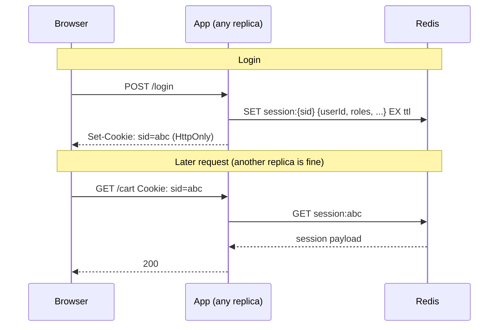

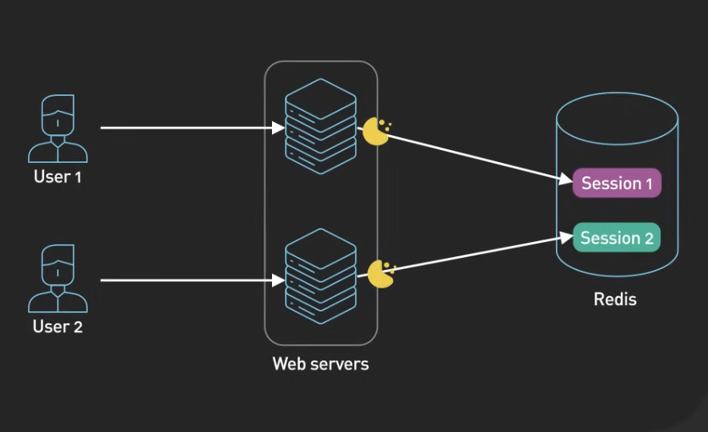

**Why Redis**

- **Low latency** — most requests do at least one `GET` (or a short pipeline) per session lookup.
- **Native TTL** — idle sessions expire without a custom sweeper (`EX` / `EXPIRE` on the session key).
- **Shared by all replicas** — any instance can serve any user after login; no **sticky sessions** required on the load balancer.

Redis holds **short-lived conversation state**, not the user system of record (that stays in the database).

**Important limitation**

Redis is **in-memory**. If the server **restarts** without durable recovery (AOF/RDB) or a warm replica, keys that existed only in RAM are **gone**—users appear logged out or see errors until they sign in again. Plan persistence, replication, or accept that risk for non-critical sessions.

---

## Idempotency keys

Clients **retry** POSTs. Without deduplication you risk **double payment**, double shipment, duplicate side effects.

**Pattern**: client sends `Idempotency-Key: <uuid>`; server maps `(tenant, route, key)` → **outcome** or **in-flight marker** in Redis with TTL.

```text
SET idempotency:pay:user42:<key> IN_PROGRESS NX EX 86400
```

- If `NX` fails → return cached response or await in-flight (policy choice).
- On success/failure, **replace** value with serialized result.

Same `Idempotency-Key`: duplicate POSTs replay the answer.

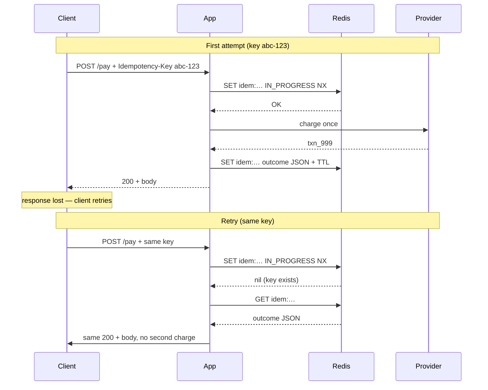


---

## Reference

- [Distributed locks with Redis](https://redis.io/docs/manual/patterns/distributed-locks/)
- [Token Bucket Rate Limiter](https://www.youtube.com/watch?v=cfF6nXIpDwE&t=38s)

