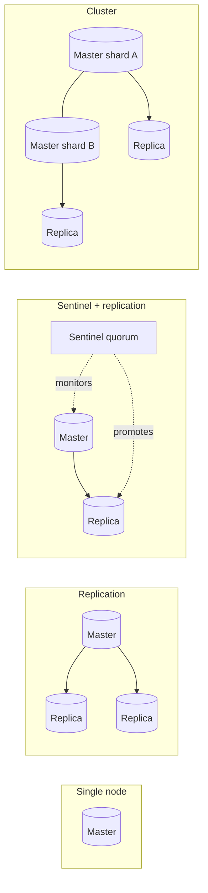
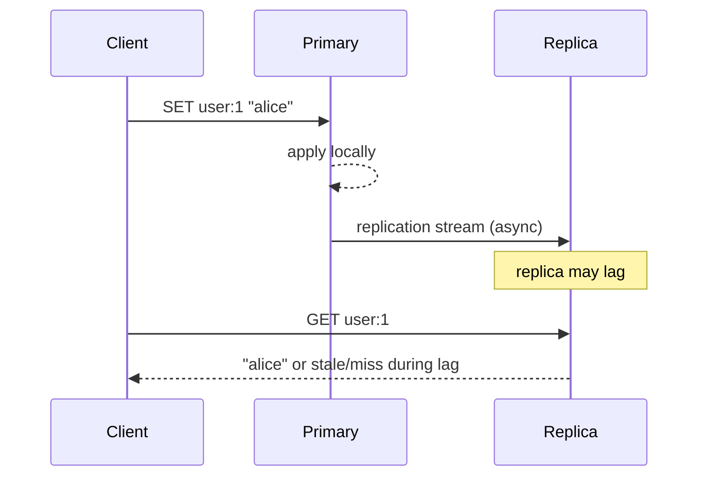
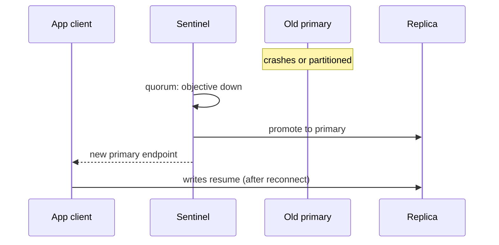

# Chapter 5 - Redis Scalability

- [Chapter 5 - Redis Scalability](#chapter-5---redis-scalability)
  - [Scaling Redis: What Problem Are We Solving?](#scaling-redis-what-problem-are-we-solving)
  - [Replication](#replication)
    - [Master–replica topology](#masterreplica-topology)
    - [Asynchronous replication and lag](#asynchronous-replication-and-lag)
    - [What replication improves (and what it does not)](#what-replication-improves-and-what-it-does-not)
    - [Read scaling and consistency on replicas](#read-scaling-and-consistency-on-replicas)
    - [Durability on the write path](#durability-on-the-write-path)
  - [Sentinel](#sentinel)
    - [Role in the architecture](#role-in-the-architecture)
    - [Failover sequence](#failover-sequence)
    - [Quorum, split-brain, and client implications](#quorum-split-brain-and-client-implications)
  - [Redis Cluster](#redis-cluster)
    - [Hash slots and sharding](#hash-slots-and-sharding)
    - [Client redirects: MOVED and ASK](#client-redirects-moved-and-ask)
    - [Multi-key operations and hash tags](#multi-key-operations-and-hash-tags)
    - [Adding capacity and resharding](#adding-capacity-and-resharding)
    - [Cluster failover](#cluster-failover)
  - [Failure Handling and Consistency Boundaries](#failure-handling-and-consistency-boundaries)
    - [Failure modes at a glance](#failure-modes-at-a-glance)
    - [What clients should assume after failover](#what-clients-should-assume-after-failover)
    - [Choosing a deployment model](#choosing-a-deployment-model)
  - [Key Takeaways](#key-takeaways)
  - [Reference](#reference)

---

## Scaling Redis: What Problem Are We Solving?

Redis grows beyond a single process, what breaks when nodes fail, and how operators and application code must adapt.

Three orthogonal pressures appear in almost every Redis deployment at scale:


| Pressure                           | Symptom                                                              | Typical response                                               |
| ---------------------------------- | -------------------------------------------------------------------- | -------------------------------------------------------------- |
| **Read throughput**                | CPU or network on one node saturates on `GET`/`HGETALL`/stream reads | Add **replicas**                                               |
| **Write throughput / memory size** | One master cannot accept more writes/sec or hold the working set     | **Shard** with **Redis Cluster**                               |
| **Availability**                   | Master crash blocks writes or loses the only copy                    | **Replicas + Sentinel** or **Cluster** with automatic failover |


None of these options gives you “free” strong consistency. Redis prioritizes **low latency** and **operational simplicity**.




---

## Replication

**Replication** copies data from one **primary** (master) to one or more **replicas**. It is the foundation for read scaling and for failover.

### Master–replica topology

- Exactly one node accepts **writes** for a given dataset (the primary).
- Replicas maintain a copy by consuming the replication stream from the primary.
- Clients may connect to replicas for reads if the application tolerates **eventual** visibility of recent writes.




### Asynchronous replication and lag

Replication is **asynchronous** by default: the primary acknowledges the client after applying the command locally; propagation to replicas happens afterward.

**Replication lag** is the delay between a write on the primary and its visibility on a replica. Lag spikes when:

- the network between primary and replica is slow or lossy;
- the replica is slow (CPU, persistence `fsync`, large key rewrite);
- the primary accepts writes faster than the replica can apply them (backlog pressure).

### What replication improves (and what it does not)


| Dimension                         | With replicas                                         | Without scaling writes             |
| --------------------------------- | ----------------------------------------------------- | ---------------------------------- |
| **Read**                          | Can scale out reads to N replicas (minus staleness)   | —                                  |
| **Write**                         | Still bounded by **one** primary                      | Same                               |
| **Total memory for one dataset**  | Full copy per replica (no sharding)                   | Same                               |
| **Availability on primary death** | Replicas exist but are **not** promoted automatically | Writes stop until manual promotion |


So replication alone is **not** high availability: you need **Sentinel** or **Cluster** to promote a replica when the primary fails.

### Read scaling and consistency on replicas

**Strategy pattern (read routing):** applications choose a **read policy** per endpoint:


| Policy                     | Behavior                                                         | Fit                                             |
| -------------------------- | ---------------------------------------------------------------- | ----------------------------------------------- |
| **Primary only**           | Strongest consistency for that single primary; no read scale-out | Locks, financial counters, just-written session |
| **Replica preferred**      | Lower load on primary; may read pre-write state                  | Dashboards, catalog caches, analytics           |
| **Replica with lag guard** | Read replica only if lag < threshold; else fall back to primary  | Mixed APIs with SLA on freshness                |


### Durability on the write path

Two related settings on the primary:

- `**min-replicas-to-write`** — refuse writes unless at least N replicas are connected (trade availability for lower risk of “acknowledged but nowhere else” writes).
- `**min-replicas-max-lag`** — treat a replica as unavailable for that rule if lag exceeds a ceiling.

These do **not** make Redis synchronous by default; they narrow the window where a single primary crash loses data that was already acknowledged to clients.

---

## Sentinel

**Redis Sentinel** provides **monitoring**, **notification**, **automatic failover**, and **configuration discovery** for replication deployments. It does **not** shard data; it keeps one logical primary available for a single replication group.

### Role in the architecture


| Responsibility         | What it means in practice                                                          |
| ---------------------- | ---------------------------------------------------------------------------------- |
| **Monitoring**         | Sentinels ping masters/replicas and mark instances subjectively down               |
| **Notification**       | Hooks for operators or automation when topology changes                            |
| **Automatic failover** | Elect a replica, promote it, reconfigure other replicas                            |
| **Service discovery**  | Clients ask Sentinels for the **current** primary address (logical name → IP:port) |


Deploy **at least three** Sentinel processes (odd quorum) on independent failure domains when possible. A single Sentinel is only useful for learning.

### Failover sequence

At a high level, when the quorum agrees the primary is unavailable:

1. **Subjective down** — enough Sentinels believe the primary is unreachable.
2. **Objective down** — quorum confirms; failover authorized.
3. **Leader election** — one Sentinel runs the failover script.
4. **Replica selection** — pick best replica (offset, priority, runid rules).
5. On chosen replica → new primary.
6. **Repoint** other replicas to the new primary.
7. **Publish** new primary endpoint to clients and remaining Sentinels.




**Client perspective during failover:**

- In-flight commands to the old primary **fail** or time out.
- Writes may be **unavailable** for seconds.
- A **short window** exists where two nodes might believe they are primary (**split-brain**) if quorum or network partitioning is misconfigured—design Sentinel count and `down-after-milliseconds` carefully.

### Quorum, split-brain, and client implications

- **Quorum** — number of Sentinels that must agree before failover.
- **Split-brain** — two primaries accepting writes; catastrophic for locks and counters.
- **Stale reads** — after promotion, former primary (if it returns) must not serve writes.

Sentinel fits when you have **one** large Redis dataset (or a few named services), need **High Availability**, and do **not** need horizontal write sharding yet.

---

## Redis Cluster

**Redis Cluster** shards data across multiple masters using **hash slots**. Each master owns a subset of slots; each master may have replicas for HA within that shard.

### Hash slots and sharding

- The keyspace is divided into **16,384 slots** (0–16383).
- Each key maps to a slot: `CRC16(key) mod 16384`.
- Each **master** owns a contiguous (or assigned) range of slots.
- **Adding nodes** means moving slots from existing masters to new ones (**resharding**).

```text
Key "user:42"  → slot 9842  → master B
Key "cart:7"   → slot 1203  → master A
```

**What Cluster adds beyond replication:**


| Capability                       | Replication only            | Cluster                          |
| -------------------------------- | --------------------------- | -------------------------------- |
| Horizontal **writes**            | No                          | Yes, per shard                   |
| Larger-than-one-node **dataset** | No (full copy each replica) | Yes, partitioned                 |
| Automatic failover               | Via Sentinel                | Per-shard replica promotion      |
| Client complexity                | Lower                       | Must follow slot map / redirects |


### Client redirects: MOVED and ASK

Cluster-aware clients maintain a **slot → node** map (cached from `CLUSTER SLOTS` or redirects).


| Reply     | Meaning                                         | Client action                        |
| --------- | ----------------------------------------------- | ------------------------------------ |
| **MOVED** | Slot permanently assigned elsewhere             | Update cache; retry on correct node  |
| **ASK**   | Slot migrating; use import endpoint temporarily | Send `ASKING` then command to target |


### Multi-key operations and hash tags

Commands that touch **multiple keys** require all keys in the **same slot**:

- `MGET`, `MSET`, transactions (`MULTI`), many Lua scripts, some Streams consumer patterns spanning keys.

**Hash tags** force related keys into one slot by hashing only the substring in `{...}`:

```text
{user:42}:profile
{user:42}:cart
```

Both keys share the tag `user:42` and land on the same slot—enabling atomic multi-key ops **for that user**.

### Adding capacity and resharding

Operational outline:

1. Add new empty master (and replicas) to the cluster.
2. **Assign slots** to the new node (`redis-cli --cluster reshard` or orchestration tooling).
3. During migration, clients see **ASK** redirects; latency may increase temporarily.
4. Rebalance until slot distribution matches target memory/CPU per node.

Plan resharding in maintenance windows or with application tolerance for elevated latency—especially for hot keys concentrated in few slots.

### Cluster failover

If a **master** fails and its replicas are reachable:

- The cluster attempts **replica promotion** for the failed master’s slots.
- A **quorum of masters** must agree the master is down (cluster’s own gossip/failover protocol—not the same process as Sentinel).

If too many masters fail or slots are uncovered, the cluster can enter **fail** states where subsets of keys are unavailable—capacity planning and **replica count per shard** matter.

**When to choose Cluster:**

- working set or write rate exceeds one machine;
- you accept client and ops complexity;
- you can model data so most hot paths are **single-key** or **hash-tagged** groups.

**When to avoid Cluster:**

- many arbitrary multi-key transactions across the whole keyspace;
- team wants simplest ops and dataset still fits one primary + replicas + Sentinel.

---

## Failure Handling and Consistency Boundaries

Redis is often described as **AP**-leaning in the CAP sense for replicated setups: under partition, availability and partition tolerance are prioritized; **linearizable** reads/writes across the whole cluster are **not** the default product promise.

### Failure modes at a glance


| Event                          | Likely symptom                    | Consistency note                                                                              |
| ------------------------------ | --------------------------------- | --------------------------------------------------------------------------------------------- |
| Primary crash before replicate | Last writes may be **lost**       | Acknowledged writes might never reach any replica                                             |
| Split-brain (misconfigured HA) | Duplicate writes, corrupted locks | Fix quorum; use fencing for critical resources                                                |
| Slot migration                 | Elevated latency, ASK storms      | Monitor migration progress; limit concurrent moves                                            |
| Full cluster partial outage    | Some keys unavailable             | Design degraded modes; don’t share one cluster for unrelated critical tiers without isolation |


### What clients should assume after failover

1. **Reconnect** to the new primary.
2. **Retry idempotent reads**; **non-idempotent writes** need business-level idempotency keys.
3. **Invalidate local caches** of topology and sometimes of data (old primary’s last writes may never appear on the new primary).
4. **Expect a brief write outage**; design APIs and UX accordingly.

### Choosing a deployment model


| Need                              | Start here                                          | Grow to                                           |
| --------------------------------- | --------------------------------------------------- | ------------------------------------------------- |
| HA, single dataset, moderate size | Primary + replicas + **Sentinel**                   | Cluster when write/memory ceiling hit             |
| Large dataset or write scale      | **Cluster** (+ replicas per shard)                  | Multi-cluster by domain if blast radius too large |


---

## Key Takeaways

- **Replication** scales reads and enables failover copies; it does **not** scale writes or total memory for one logical dataset.
- **Sentinel** automates failover and discovery for a **single-shard** HA deployment.
- **Cluster** shards by **hash slots**; clients must handle **MOVED/ASK**; design keys for **hash tags** when you need multi-key atomicity.
- **Consistency** is bounded: async replication, failover windows, and replica reads all require explicit application policy.
- **Observability** (Prometheus + Grafana + `redis_exporter`) is part of scalability—failover and resharding without metrics are blind flight.

---

## Reference

- [Redis replication](https://redis.io/docs/latest/operate/oss_and_stack/management/replication/) — topology, replication ID, partial resync.
- [Redis Sentinel](https://redis.io/docs/latest/operate/oss_and_stack/management/sentinel/) — failover, quorum, client configuration.
- [Redis Cluster specification](https://redis.io/docs/latest/operate/oss_and_stack/reference/cluster-spec/) — slots, redirects, resharding.

